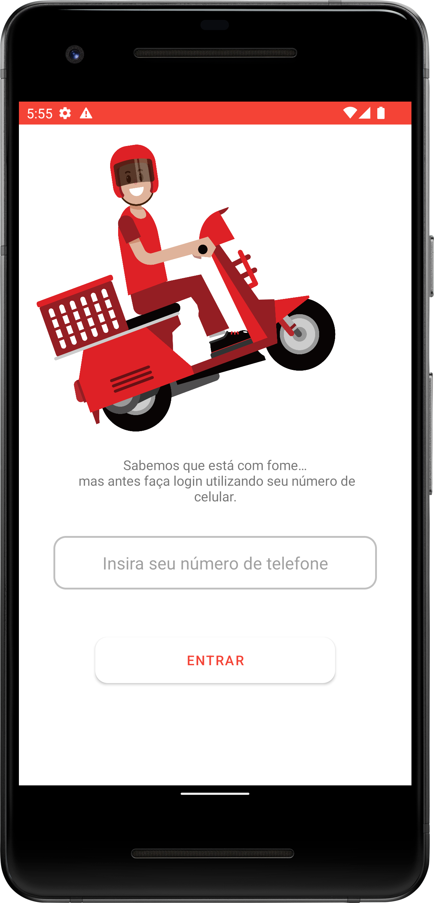
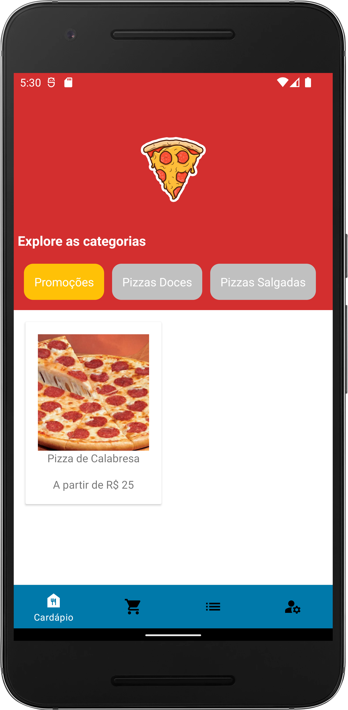
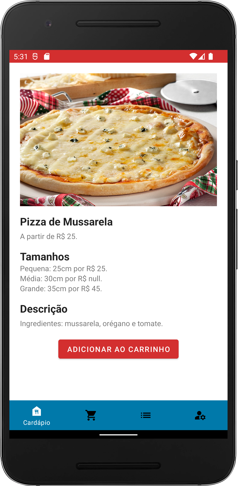
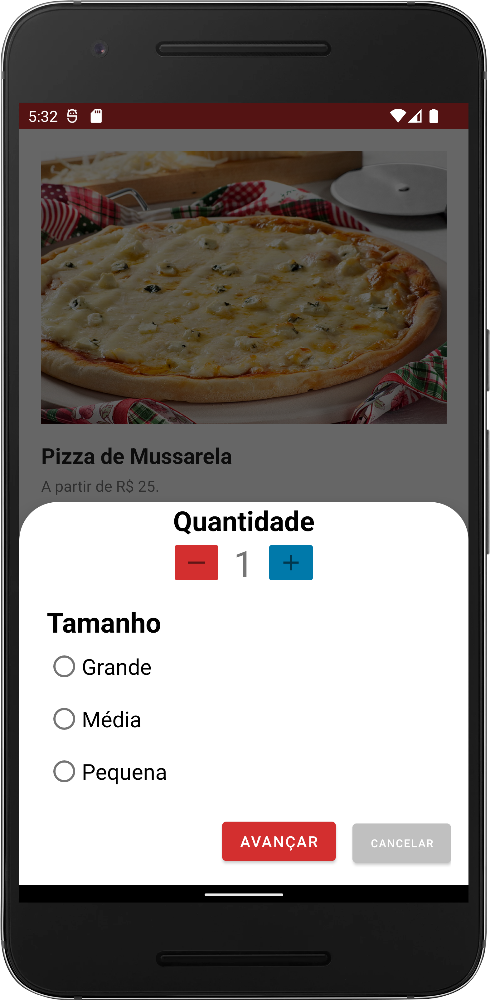
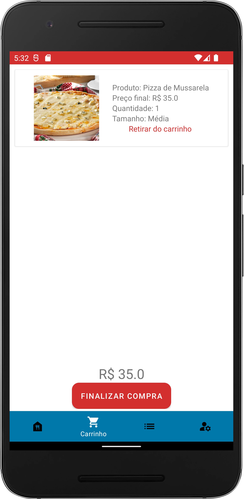
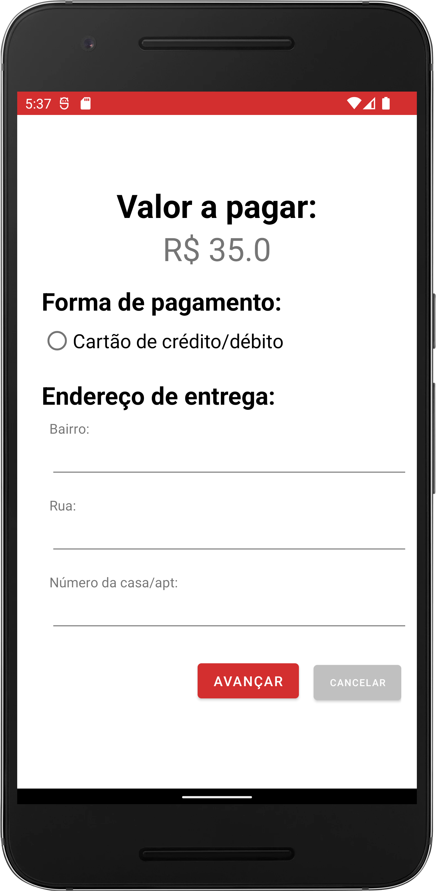
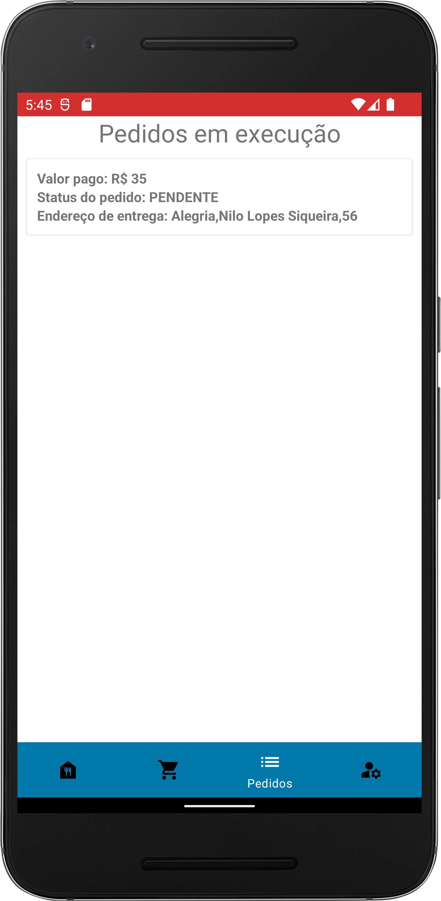
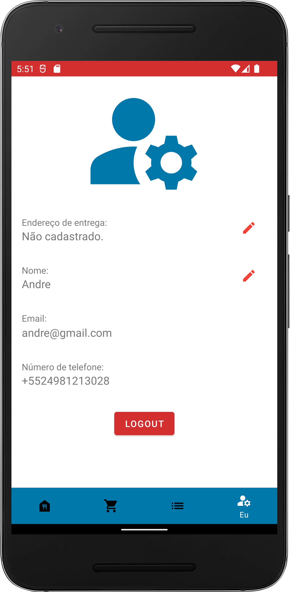
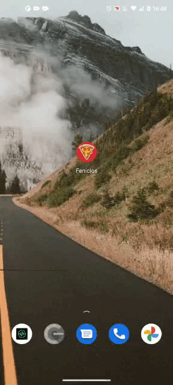

<h1 align="center">Sistema Fenícios</h1>

 
  O Sistema Fenícios se divide em duas aplicações, ambas mobile uma para interação com o usuário e outra apenas para o pseudo dono do estabelecimento, onde pode acessar e ter controle do estabelicimento com privilégios por exemplo de criar/excluir/modificar produtos, receber pedidos e modificar seu status, obter acesso a quantidade de vendas entre outras funcionalidades. 

<h1 align="center">Aplicação em desenvolvimento</h1>

Tabela de conteúdos
=================
<!--ts-->
   * [Sobre](#sobre-book)
   * [Tecnologias](#tecnologias-rocket)
   * [Features](#features-)
   * [Rodando aplicativo](#rodando-o-aplicativo--)
   * [Fotos](#screenshots-camera)
   * [Gifs](#gifs-movie_camera)
   * [Autor](#autor) 
<!--te-->

## Sobre :book:
                                                           🚧  Em construção  🚧

## Tecnologias :rocket:

As seguintes ferramentas estão sendo utilizadas no desenvolvimento do projeto:

- [Kotlin](https://kotlinlang.org/)
- [Firebase](https://firebase.google.com/)
- [Lottie](https://lottiefiles.com/)
- [Glide](https://github.com/bumptech/glide)
- [Mercado Pago API](https://www.mercadopago.com.br/developers/pt/docs/checkout-pro/landing)

## Features 🛠 

- [x] Splash Screen animada utilizando Lottie;
- [x] Autenticação por número de telefone;
- [x] Cadastro de usuário;
- [x] Requisição de categorias e produtos;
- [x] Detalhes de produtos;
- [x] Adicionar/retirar produtos do carrinho;
- [x] Completar automaticamente endereço caso o usuário tenha um cadastrado;
- [x] Implementação da API do Mercado Pago para forma de pagamento;
- [x] Finalização de fluxo de compra;
- [x] Criar pedidos no banco de dados;
- [x] Listagem de pedidos;
- [x] Edição de nome de usuário e endereço de entrega;
- [ ] Adicionar cálculo de frete;
- [ ] Bugs eliminados e configurações terminadas. 

## Rodando o aplicativo  🎲  

<h4 align="center"> 
	                                                   🚧  Em construção  🚧
</h4>

## Screenshots :camera: 

<h1 align="center">
  
  
  
  
  
  
  
  
  
  
  </h1>
  
  
## Gifs :movie_camera: 

<h1 align="center">
   
</h1>

<h1 align="center">
   
</h1>

## Autor

Feito por André Esperança!

Contatos :
 

<a href="https://github.com/andreesperanca">
   
 
  
  <a href="https://github.com/andreesperanca" title="">André Esperança</a>
